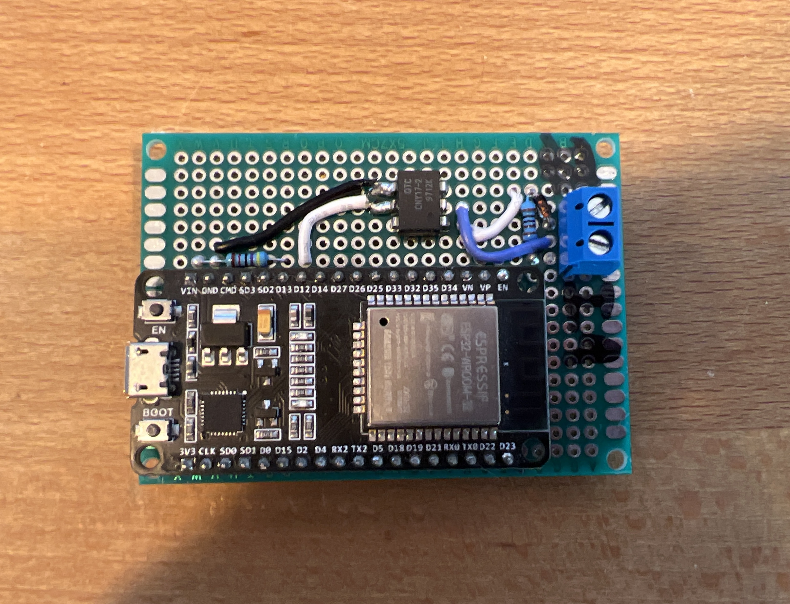
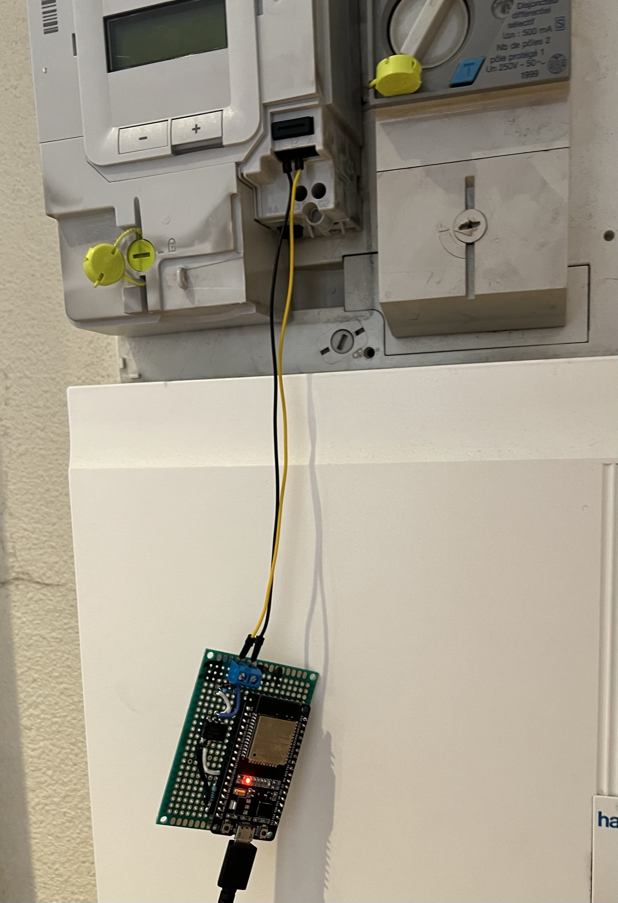

# linky-tic-mqtt



Export the data from the French electric meter Linky to an MQTT broker, which can then be used in HomeAssistant (or anything else you like).

# Acknowledgements

I haven't done much work on this 😬 90% of the code and 100% of the electronics were designed by : 

- ["Decodeur TIC Linky" by MicroQuettas](https://forum.arduino.cc/t/decodeur-tic-linky/512858/29)
- [Module téléinformation TIC by faire-ca-soi-meme.fr](https://faire-ca-soi-meme.fr/domotique/2016/09/12/module-teleinformation-tic/)
- [Affichage déporté pour compteur Linky by ouiaremakers.com](https://ouiaremakers.com/posts/tutoriel-diy-affichage-deporte-pour-compteur-linky)

I've just re-packaged it, thanks to all those people !

# Hardware


Plug into pin 12 on the ESP32.

# Flashing the ESP32

Rename `config.h.renameme` to `config.h` and change the values according to your setup, then flash `main.ino` like you would normally.

# Wiring

Open the front green case of the meter, and plug the circuit into the I1 and I2 diagnostics ports. Be careful not to kill yourself (seriously tho be careful).

Plug-in the ESP.



# HomeAssistant

_this assumes you use HomeAssistant and its Mosquitto add-on as an MQTT broker_

In your HomeAssistant `configuration.yaml`, add the following: 

```
sensor:
  - platform: mqtt
    state_topic: "energy/electricity_consumption_wh"
    device_class: energy
    state_class: total_increasing
    name: Consomation d'Electricite
    unit_of_measurement: "Wh"
  - platform: mqtt
    state_topic: "energy/electricity_instant_intensity_a"
    device_class: current
    state_class: measurement
    name: Courant Instantane
    unit_of_measurement: "A"
  - platform: mqtt
    state_topic: "energy/electricity_apparent_power_va"
    device_class: apparent_power
    state_class: measurement
    name: Puissance Apparente
    unit_of_measurement: "VA"
```

You can then go to `/config/energy/dashboard` and setup the hass integration. I've personally opted to use an helper to store the electricity price as it makes it easy to update whilst maintaining continuity in the data. Here's the result : 


